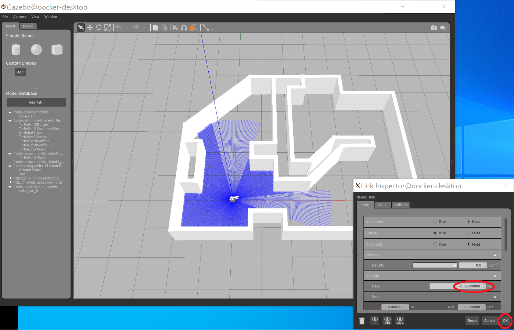

# ROS application sample with Behavior Tree and ros_actor
actor_demo is a sample application that shows an example of integrated control of a mobile arm robot. The robot searches for Coke Cans in the maze, picks them using the arm, and transports them to the platform using a pallet.

The purpose of this application sample is to demonstrate the construction of an integrated application that performs complex operations by using the main functions of ROS2 such as Nav2 and MoveIt2.

Another purpose here is to propose strategies that enable people who are not necessarily familiar with building ROS applications, such as students and AI researchers, to build ROS programs quickly. As a key element for this purpose, we will use the Python language, and
- Behavior Tree,
- ros_actor.

ros_actor is a newly developed small-scale middleware for ROS that uses an actor-like programming model to make it easier to write difficult real-time processing programs that use a lot of callbacks.

ros_actor can work closely with py_trees, a Python implementation of Behavior Tree. Behavior Tree makes it easy to build the global structure of real-time programs through polling performed by each behavior. In addition to this mechanism, ros_actor allows to implement local real-time programs without sacrificing real-time performance and make them available from Behavior Tree. By doing so, they have a complementary relationship.

This approach makes it possible to build complex ROS applications in a structured manner to be used for
- Education,
- AI research using robots,
- Quick prototyping in robot business.

The entire program of this sample runs as a single docker and operates by entering simple commands. It is recommended to operate from VSCode.

## Demo video
<div><video controls src="./doc/demo.mp4" muted="false"></video></div>


## Installation
- Go to working directory of any location
- Make sure the DISPLAY environment variable is set properly

```
$ printenv DISPLAY # for checking DISPLAY environment variable
$ git pull http://192.168.128.23/ktago/actordemo.git
$ cd actordemo
$ docker compose build
$ docker compose up
```

By these operations, docker will now start and an X window will appear. From now on, you will work within this window.

```
# rinit
# cd /root/actordemo/pytwb_ws
# pytwb
> create cm1
Y
```

The installation is now complete.

## Execution
- Launching the simulation environment

```
# run_all
```

You will now see one Gazebo screen and two Rviz screens.
To run the demo, as shown in the video above, you need to add
- euro pallet,
- Coke Can,
from Gazebo's Insert tab. The euro pallet should be in place at the top left. Any Coke Can position should work.

The original Coke Can model is too heavy to pick as it is, so edit the model and set the weight to around 0.04kg.
- Place the Coke Can in any position, select it with the mouse and select 'Edit model' from the operation list displayed by right-clicking.
- The entire screen will turn white, so select the Coke Can again and double left-click to display the editing screen.
- From there, change the Mass value from 0.39 kg to 0.039 kg and click 'ok'



- Exit model editing mode with cntl-X and save the edited model with a different name

Next, start the ros_actor command interpreter and run the application.
- Launch vscode, attach to 'actordemo' docker from Remote Explorer, and open the /root/actordemo directory.

- When you run 'pytwb_ws/src/cm1/\_\_main\_\_.py from vscode, a command prompt will appear.

- From the command prompt, type 'bt_pick_place' to start the demo.

## Application Behavior Tree
'bt_pick_place' entered from the command prompt is the file name of the Behavior Tree in xml format. The entity is located in: 

/root/pytwb_ws/src/cm1/cm1/trees/bt_pick_place.xml  

of the docker.
(The /root/pytwb_ws directory in docker corresponds to the /actor_demo/pytwb_ws directory in the Git repository.)

```
<root>
    <BehaviorTree ID="bt_all">
    <Sequence name="main">
        <bt_search name="global_search"/>
        <bt_catch name="pick_action"/>
        <bt_carry name="carry_action"/>
        <ArmHome name="arm_home" />
        <Mini_Walk name="mini_walk" target="[-20]"/>
        <SetBlackboard name="set_target" key="target_pose" value="[(1.0, 0.0, 0.0)]" />
        <GoToPose name="move_to_place_loc"/>
    </Sequence>
    </BehaviorTree>
</root>
```

This bi_pick_place primarily works by calling the underlying Behavior Trees.
- bt_search: Search for CokeCans
- bt_catch: Picking Coke Cans
- bt_carry: Transport and place Coke Cans

## Internal structure
ros_actor is heavily used to implement each Behavior Tree. As the main thing,
- Nav2 operation,
- MoveIt2 operation,
- Analysis of camera information,

etc.

[Detailed description](./doc/app.pdf)

## ros_actor mechanism documentation
- [Principle of ros_actor](./doc/actor.pdf)

## Related repositories and sites
- [ros_actor](https://github.com/momoiorg-repository/ros_actor)
- [pytwb](https://github.com/momoiorg-repository/pytwb_demo)
- [vector_map](https://github.com/RobotSpatialCognition/vector_map)
